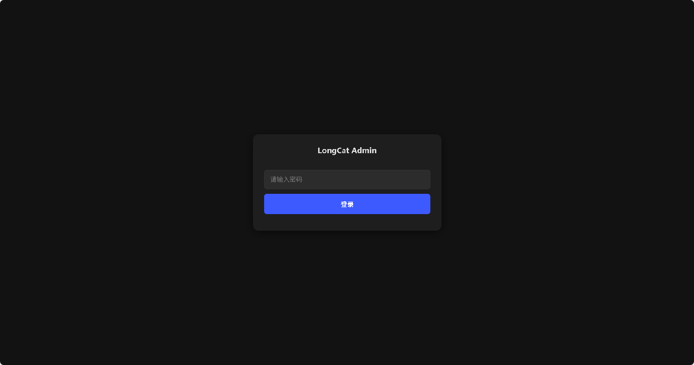
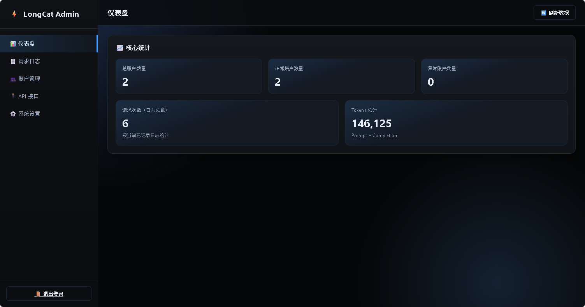
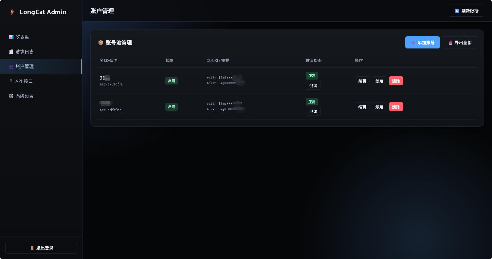
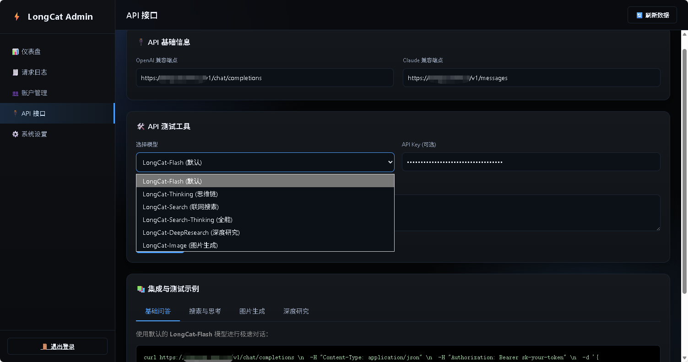
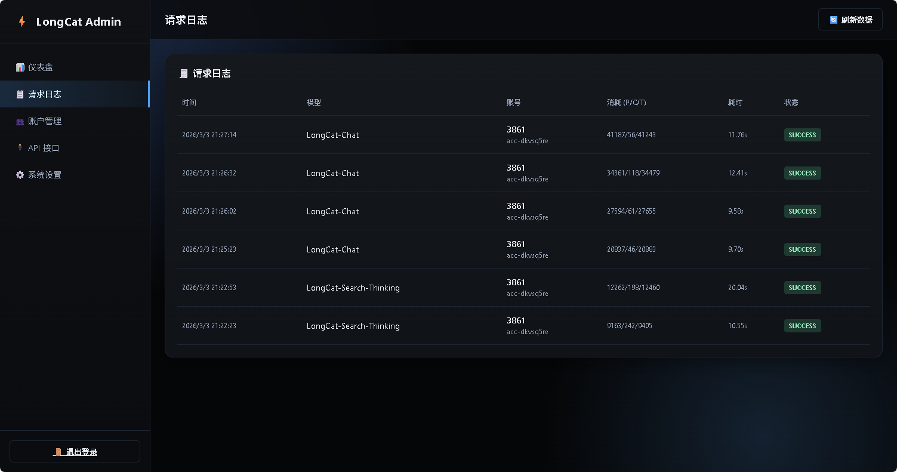
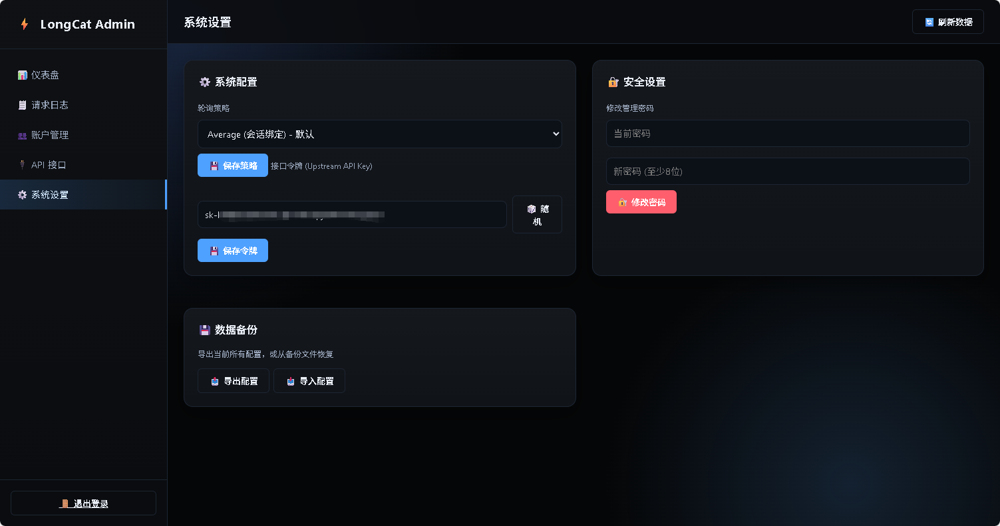

# LongCat Web API Wrapper

本项目基于 https://github.com/JessonChan/longcat-web-api 修改。

一个将 LongCat 能力包装为 OpenAI / Claude 兼容接口的轻量服务，内置深色后台管理页面、账号池与请求日志。

目前openclaw聊天可以调用工具，思考无法调用工具，希望有大佬可以修复下。

## 项目简介

本项目的目标是让已有的 OpenAI 或 Claude 客户端，几乎不改代码即可接入 LongCat。

你可以把它理解成一个“兼容层”：

- 对外提供标准接口：`/v1/chat/completions`、`/v1/messages`
- 对内转发到 LongCat 官方接口
- 用后台管理多个 LongCat 账号（Cookie）和路由策略
- 统一提供日志、Token 统计、鉴权和 CORS

> 当前版本已禁用视频生成功能（包含 API 层和后台示例），避免长轮询/网关超时导致不稳定。

## 核心特性

- 针对 OpenClaw 请求做了适配：过滤无用渲染元信息，减少脏上下文干扰
- 强化工具调用兼容：当客户端传入 `tools` 时，强制约束输出 `tool_calls` JSON，提升网页/客户端技能调用成功率
- OpenAI 兼容接口：`POST /v1/chat/completions`
- Claude 兼容接口：`POST /v1/messages`
- 支持流式与非流式响应
- 支持能力模式：聊天、搜索、思考、全能、图片生成、深度研究
- 支持图片结果渲染（含 4 图 2x2 排版输出）
- 后台账号池管理（新增/编辑/启停/测试）
- 账号添加支持两种方式：
  - 粘贴完整 Cookie 字符串，一键自动识别并解析
  - 手动填写关键 Cookie 字段
- 账号调度策略：`average`（会话均衡）/`sequential`（顺序故障转移）
- 后台仪表盘统计：
  - 总账户数量
  - 正常账户数量
  - 异常账户数量
  - 请求次数
  - Tokens 总计
- 请求日志独立菜单展示
- 系统配置支持一键导出 / 导入
- 配置热加载（后台修改无需重启）+ 持久化存储（重启不丢失）
- 可选上游 API Key 保护（`Authorization: Bearer` 或 `X-Api-Key`）
- CORS 配置与热更新配置文件








## 目录结构

```text
.
├── admin/                  # 后台页面与管理 API
├── api/                    # OpenAI/Claude 适配与 LongCat 请求处理
├── config/                 # 配置模型、存储、cookie 解析
├── conversation/           # 会话与账号绑定管理
├── logging/                # 请求日志存储
├── types/                  # 通用类型
├── main.go                 # 程序入口
├── Dockerfile
└── docker-compose.yml
```

## 运行要求

- Go 1.21+
- 可访问 LongCat 的网络环境
- 至少 1 个可用 LongCat 账号 Cookie（推荐使用后台添加）

## 快速开始

### 1) 本地运行

```bash
go mod tidy
go run .
```

默认监听：`0.0.0.0:8082`

启动后可访问：

- 管理后台：`http://127.0.0.1:8082/admin`
- OpenAI 兼容：`http://127.0.0.1:8082/v1/chat/completions`
- Claude 兼容：`http://127.0.0.1:8082/v1/messages`

首次启动会自动创建 `./data/config.json`，并在终端打印后台初始密码。

### 2) Docker 运行

```bash
docker compose up -d --build
```

默认映射端口：`8082:8082`

数据目录：`./data`（已挂载持久化）

## 部署教程

### 单机部署（推荐）

1. 拉取代码并构建

```bash
go build -o longcat-web-api .
```

2. 创建数据目录并启动

```bash
mkdir -p data
./longcat-web-api
```

3. 登录后台并完成初始化

- 打开 `/admin`
- 使用控制台打印的默认密码登录
- 立刻修改密码
- 添加至少 1 个 LongCat 账号

### 反向代理（Nginx/Caddy）

建议将 `/v1/*` 和 `/admin*` 都代理到本服务，保持长连接与流式输出。

关键建议：

- 保留 `X-Forwarded-Proto`、`X-Forwarded-Host`
- 关闭代理缓冲（SSE 场景）
- 适当提高超时

本项目后台已兼容反代协议识别，页面会自动显示正确的 `https://` API 地址。

## 配置说明

配置文件路径：`./data/config.json`

服务会自动轮询文件变更并热加载（无需重启）。

### 主要配置项

| 字段 | 说明 | 默认值 |
|---|---|---|
| `serverPort` | 服务端口 | `8082` |
| `bindAddr` | 监听地址 | `0.0.0.0` |
| `corsAllowOrigins` | CORS 允许来源 | `*` |
| `upstreamApiKey` | 访问本服务的鉴权 key（可空） | 空 |
| `longcat.apiUrl` | LongCat 聊天接口 | `https://longcat.chat/api/v1/chat-completion-V2` |
| `longcat.sessionUrl` | LongCat 会话创建接口 | `https://longcat.chat/api/v1/session-create` |
| `longcat.timeoutSeconds` | 上游请求超时（秒） | `30` |
| `strategy.type` | 账号调度策略 | `average` |

### 环境变量（启动时读取）

| 变量 | 说明 |
|---|---|
| `SERVER_PORT` | 覆盖默认端口 |
| `BIND_ADDR` | 覆盖绑定地址 |
| `CORS_ALLOW_ORIGINS` | 覆盖 CORS |
| `UPSTREAM_API_KEY` | 覆盖访问鉴权 key |
| `LONGCAT_API_URL` | 覆盖 LongCat API 地址 |
| `LONGCAT_SESSION_URL` | 覆盖会话创建地址 |
| `LONGCAT_MODEL` | 会话创建默认模型（可空） |
| `LONGCAT_AGENT_ID` | 会话创建默认 agent（可空） |
| `TIMEOUT_SECONDS` | 默认超时秒数 |
| `VERBOSE` | `true` 开启详细日志 |

> 账号 Cookie 不建议用环境变量硬编码，推荐在后台“账户管理”中维护。

## 使用说明

### 一、后台管理流程

1. 登录 `/admin`
2. 进入“账户管理”添加 LongCat 账号（支持粘贴完整 Cookie）
3. 在“系统设置”中按需设置：
   - 调度策略（average / sequential）
   - 上游 API Key（可选）
4. 在“API 接口”里复制端点、在线测试请求
5. 在“请求日志”中查看调用情况

### 二、模型路由规则

OpenAI 请求中的 `model` 只用于模式识别，不强绑定官方模型名：

- 含 `thinking`：开启推理模式
- 含 `search`：开启联网搜索
- 含 `search` + `thinking`：全能模式（联网 + 推理）
- 含 `deepresearch` 或 `deep-research`：走深度研究 Agent
- 含 `image` 或 `draw`：走图片生成 Agent
- 含 `video`：直接拒绝（视频功能已禁用）

### 三、OpenAI 兼容调用

#### OpenClaw / 工具调用示例

当客户端传入 `tools` 时，服务会自动注入紧凑系统提示，强制模型以 `tool_calls` JSON 结构返回，避免网页端“会说不会调”的情况。

```bash
curl http://127.0.0.1:8082/v1/chat/completions \
  -H "Content-Type: application/json" \
  -d '{
    "model": "LongCat-Search-Thinking",
    "messages": [
      {"role": "user", "content": "帮我查一下今天上海天气"}
    ],
    "tools": [
      {
        "type": "function",
        "function": {
          "name": "get_weather",
          "description": "获取指定城市天气",
          "parameters": {
            "type": "object",
            "properties": {
              "city": {"type": "string"}
            },
            "required": ["city"]
          }
        }
      }
    ],
    "stream": false
  }'
```

返回的关键字段示例（节选）：

```json
{
  "choices": [
    {
      "finish_reason": "tool_calls",
      "message": {
        "role": "assistant",
        "tool_calls": [
          {
            "type": "function",
            "function": {
              "name": "get_weather",
              "arguments": "{\"city\":\"上海\"}"
            }
          }
        ]
      }
    }
  ]
}
```

#### 非流式

```bash
curl http://127.0.0.1:8082/v1/chat/completions \
  -H "Content-Type: application/json" \
  -d '{
    "model": "LongCat-Flash",
    "messages": [
      {"role": "user", "content": "你好"}
    ],
    "stream": false
  }'
```

#### 流式

```bash
curl http://127.0.0.1:8082/v1/chat/completions \
  -H "Content-Type: application/json" \
  -d '{
    "model": "LongCat-Search-Thinking",
    "messages": [
      {"role": "user", "content": "总结一下本周 AI 行业动态"}
    ],
    "stream": true
  }'
```

#### 图片生成

```bash
curl http://127.0.0.1:8082/v1/chat/completions \
  -H "Content-Type: application/json" \
  -d '{
    "model": "LongCat-Image",
    "messages": [
      {"role": "user", "content": "画一只赛博朋克风格的猫"}
    ],
    "stream": true
  }'
```

### 四、Claude 兼容调用

```bash
curl http://127.0.0.1:8082/v1/messages \
  -H "Content-Type: application/json" \
  -H "anthropic-version: 2023-06-01" \
  -d '{
    "model": "claude-3",
    "max_tokens": 1000,
    "messages": [
      {"role": "user", "content": "你好，帮我写个 Go 示例"}
    ],
    "stream": false
  }'
```

### 五、接入任意 OpenAI 客户端

- Base URL: `http://<your-host>:8082/v1`
- API Key: 任意值（若你在后台配置了 `upstreamApiKey`，则必须使用该值）
- Model: 按上面路由规则填写

## 安全建议

- 首次登录后台后务必修改默认密码
- 生产环境务必配置 `upstreamApiKey`
- 后台和 API 建议放在反向代理后，仅开放必要入口
- 不要把 `data/config.json` 提交到公开仓库

## 常见问题

### 1) 没有可用账号 / 请求直接失败

- 到后台检查是否至少有 1 个启用账号
- 点击“测试”检查 Cookie 是否过期

### 2) 返回 401 unauthorized

- 说明你启用了 `upstreamApiKey`，请求头里要带：
  - `Authorization: Bearer <key>` 或
  - `X-Api-Key: <key>`

### 3) 图片只返回 URL 或排版不理想

- 当前服务会尽量转换为 Markdown 图片并在 4 图时输出 2x2
- 若客户端本身不支持该 Markdown 渲染，显示效果取决于客户端

### 4) 反代后后台显示 http 链接

- 请确认反向代理传递了 `X-Forwarded-Proto` / `X-Forwarded-Host`

## 开发与调试

```bash
go mod tidy
go test ./...
go run .
```

打开详细日志：

```bash
VERBOSE=true go run .
```

## 许可证

MIT License
